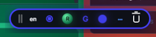

# OrcaVoice

A minimal, always-available speech-to-text dictation overlay for Windows, macOS, and Linux.

Press a key. Speak. Text appears wherever your cursor is.



## How it works

OrcaVoice lives hidden in your system tray. Press your trigger key (default: `\`) and a tiny floating bubble appears. Speak naturally. Press the key again and your words are transcribed and pasted into whatever app has focus.

**Toolbar controls:** drag · language · mic · mode · provider · status · settings · cancel

## Features

- **Invisible until needed** — hidden in the tray, summoned by a single key
- **Groq Whisper Large v3 Turbo** for sub-second transcription
- **OpenAI gpt-4o-transcribe** as an alternative provider
- **One-key toggle** — press `\` to start, press again to stop and paste
- **Audio feedback** — native start/stop WAV sound so you know it's listening
- **System audio ducking** — mutes other app audio while recording, then restores it on stop
- **Visual feedback** — pulsing status dot and border glow during recording
- **Movable** — drag the bubble anywhere with the grab handle
- **Customizable outline** — pick your own bubble accent color
- **Auto-start on boot** — optional Windows/macOS/Linux startup
- **API keys stored securely** — OS keyring + settings.json fallback
- **Five dictation modes** — Raw, Grammar, Email, Translate, Custom

## Setup

### Prerequisites

- [Node.js](https://nodejs.org/) 20+
- [Rust](https://rustup.rs/) 1.77+
- System microphone access

### Install dependencies

```bash
npm install
```

### Run in development

```bash
npm run tauri:dev
```

### Build for production

```bash
npm run tauri:build
```

## Getting API keys

### Groq (default, fastest)

1. Go to [console.groq.com](https://console.groq.com/keys)
2. Create an API key (starts with `gsk_`)
3. Open OrcaVoice Settings (`···` button)
4. Paste your key and click **Save**

### OpenAI (alternative)

1. Go to [platform.openai.com/api-keys](https://platform.openai.com/api-keys)
2. Create an API key (starts with `sk-`)
3. Switch provider to OpenAI in Settings
4. Paste your key and click **Save**

## Using OrcaVoice

1. Press `\` (or your configured trigger key) — the bubble appears and the start sound plays
2. Speak naturally — other app audio is muted while recording
3. Press `\` again — the stop sound plays, audio is restored, and text is transcribed/pasted

### Sound effects and audio ducking

This part was deliberately built around the working Windows behavior:

- **SFX playback:** `src-tauri/src/feedback.rs`
- **SFX asset:** `src-tauri/resources/sfx-stop.wav`
- **Current behavior:** the same end/done WAV is used for both start and stop feedback
- **Playback API:** Windows `PlaySoundW` with an embedded WAV copied to the temp directory
- **Ducking:** `src-tauri/src/ducking.rs` mutes other process audio sessions after the start SFX plays
- **Recovery:** app launch, stop, cancel, and error paths call audio recovery so sessions do not stay muted

To change the sound effect, replace `src-tauri/resources/sfx-stop.wav` with a short PCM WAV file. Recommended format: mono, 44.1 kHz, 16-bit PCM, under 500 ms.

Keep this order for reliable behavior:

```text
Start: play SFX → start recording → duck other audio
Stop: restore other audio → play SFX → transcribe/paste
```

Avoid replacing this with WebAudio or `Beep()`:

- WebAudio can be silent from the global-hotkey path.
- `Beep()` is audible but harsh/distorted and has no useful volume control.
- Ducking before the start SFX can mute the SFX itself.

### Settings popover

Click `···` on the bubble to access:
- **Provider** — switch between Groq and OpenAI
- **Mode** — Raw, Grammar correction, Email formatting, Translate to English, Custom
- **Trigger key** — change the global hotkey
- **Outline color** — customize the bubble's accent border
- **Auto-start** — toggle launch on system startup
- **API key** — paste, save, or clear provider keys

## Tech stack

| Layer | Technology |
|-------|-----------|
| Desktop shell | Tauri v2 |
| Backend | Rust (cpal, reqwest, enigo, keyring) |
| Frontend | React + TypeScript + Vite |
| STT | Groq Whisper Large v3 Turbo / OpenAI gpt-4o-transcribe |
| Clipboard paste | Enigo keyboard simulation |

## Privacy

Audio is captured locally and sent **only** when you stop recording. Audio is sent directly to your chosen provider (Groq or OpenAI). No intermediate servers. No audio retention. Transcription history is stored locally in your app data directory.

## License

MIT — SquareCircle Labs
